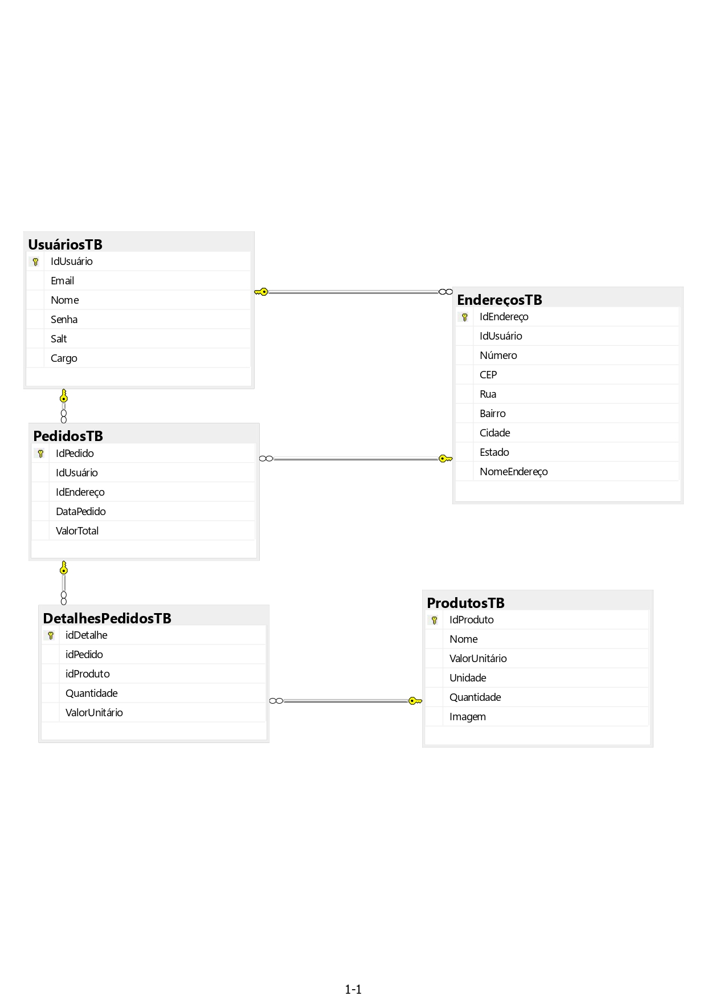

# Por que escolhi fazer este projeto?
Eu queria fazer um projeto abrangente que me permitisse aprender sobre diversos aspectos da programação, assim me proporcionando um melhor entendimento da "big picture" de um sistema de dados.
Entre esses aspectos da programação, estão:
* Uso de **Api's públicas** para coleta de dados 
* Conceitos de Data Science utilizando **Python (Pandas e Numpy)**
* Uso de bancos de dados **SQL** e relações entre diferentes tabelas
* Criação de Api's para a comunicação entre o banco de dados e frontEnd (utilizando **c#**)
* Uso de **requests, JSON e JavaScript** para lidar com os métodos criados pelas Api's do backend
* Autenticação, Autorização e segurança de usuários com token jwt, senhas hash, salt e pepper
* Criação de um site (html e css) para uma demonstração visual de todos os conceitos construídos
* Uso de **Git e Github** para controle de versões e salvar arquivos
# Como foi o planejamento para a criação do projeto? 
Eu comecei o planejamento pesquisando sobre quais Api's públicas eu gostaria de usar. Depois de muita pesquisa, uma que me interessou bastante pelo quão completa e sem muitos problemas foi a **Spoonacular Api**.
A partir dela, estudei como normalmente é a relação entre tabelas no banco de dados, e fiz um draft inicial com todas ideias que eu queria implementar no projeto no [figma](https://www.figma.com/file/oFvf9VsMy6DIrvGRUY4kJZ/Site-Compras-mercado?type=whiteboard&node-id=0%3A1&t=jT3Fmy5WAPWk1RRC-1) por meio de post-its. 
Com essa página do figma, fiz parte a parte do projeto seguindo os post-its.
# Projeto:

  
Coleta de dados

  Toda a parte de coleta de dados está na pasta "Dataset".
  Os dados foram coletados pela parte de [ingredientes](https://spoonacular.com/food-api/docs#Get-Ingredient-Information) da spoonacular Api. No próprio site há uma lista com os 1000 ingredientes mais famosos e seus respectivos id's. Com os id's, foi possível fazer requests para pegar as informações dos ingredientes, coloca-las num dataframe, e limpá-las, para enfim, adiconá-las ao banco de dados sql 

  
Banco de dados Sql

  ## Diagrama do banco de dados:

  Pelo diagrama, é possível ver que há 5 tabelas no banco de dados, que se conectam por seus id's.
  A criação do banco de dados e suas tabelas foram feitas com os comandos do arquivo "Datatables.sql"
  * A tabela usuários possui as colunas idUsuário (key primária), email, nome, senha (já com hash salt e pepper), salt (criado pelo backend) e cargo (cliente ou moderador)
  * A tabela endereços possui uma relação "1 to many" com a de usuários, ou seja, o mesmo usuário pode possuir vários endereços diferentes. Cada endereço é conectado com o usuário pelo idUsuário. Ela possui as colunas Número, Cep, Rua, Bairro, Cidade, Estado e NomeEndereço (por exemplo casa, trabalho, etc)
  * A tabela Pedidos é a tabela com todos os pedidos de compras feitos no site. Tem uma relação "1 to many" com as tabelas usuário e endereços (cada usuário e endereço podem possuir vários pedidos), e são conectados pelos seus respectivos id's. Além disso, ela possui a data do pedido, e o seu valor total
  * A tabela DetalhesPedidos é a tabela que mostra os produtos e suas quantidade compradas em cada pedido. Possui relação "1 to many" com pedidos (mesmo pedido pode possuir vários DetalhesPedidos, ou seja vários produtos diferentes comprados no mesmo pedido). 
  * A última tabela é a de produtos, que é a tabela feita com os dados da spoonacular api. Possui uma relação "1 to many" com a detalhesPedidos, o mesmo produto pode estar em vários pedidos diferentes.

  
Backend c#

  
FrontEnd Javascript Html Css

