# Por que escolhi fazer este projeto?
Eu queria fazer um projeto abrangente que me permitisse aprender sobre diversos aspectos da programação, assim me proporcionando um melhor entendimento da "big picture" de um sistema de dados.
Entre esses aspectos da programação, estão:
* Uso de **Api's públicas** para coleta de dados 
* Conceitos de Data Science utilizando **Python (Pandas e Numpy)**
* Uso de bancos de dados **SQL** e relações entre diferentes tabelas
* Criação de Api's para a comunicação entre o banco de dados e frontEnd (utilizando **c#**)
* Uso de **requests, JSON e JavaScript** para lidar com os métodos criados pelas Api's do backend
* Autenticação, Autorização e segurança de usuários com token jwt, senhas hash, salt e pepper
* Criação de um site (html e css) para uma demonstração visual de todos os conceitos construídos
* Uso de **Git e Github** para controle de versões e salvar arquivos
# Como foi o planejamento para a criação do projeto? 
Eu comecei pesquisando sobre quais Api's públicas eu gostaria de usar. Depois de muita pesquisa, uma que me interessou bastante pelo quão completa e sem muitos problemas foi a **Spoonacular Api**.
A partir dela, estudei como normalmente é a relação entre tabelas no banco de dados, e fiz um draft inicial com todas ideias que eu queria implementar no projeto no [figma](https://www.figma.com/file/oFvf9VsMy6DIrvGRUY4kJZ/Site-Compras-mercado?type=whiteboard&node-id=0%3A1&t=jT3Fmy5WAPWk1RRC-1) por meio de post-its. 
Com essa página do figma, fiz parte a parte do projeto seguindo os post-its.
# Projeto:

  
Coleta de dados

  Toda a parte de coleta de dados está na pasta "Dataset".
  
  Os dados foram coletados pela parte de [ingredientes](https://spoonacular.com/food-api/docs#Get-Ingredient-Information) da spoonacular Api.\ 
  Para utilizar os dados é preciso criar uma conta, e usar a apiKey gerada nos paramâmetros da query nos requests. No meu caso, eu salvei o arquivo num .env, para utilizá-lo no código sem precisar mostrar a chave diretamente. (O arquivo .env faz parte do gitignore)\
  No próprio site há uma lista com os 1000 ingredientes mais famosos e seus respectivos id's, assim, foi possível [baixá-la](https://github.com/LuccaRh/siteMercado/blob/main/Dataset/top-1k-ingredients.csv) e converte-lá para dataframe.\ 
  Com os id's, foi possível fazer requests para pegar as [informações dos ingredientes, colocá-las num dataframe, limpá-las](https://github.com/LuccaRh/siteMercado/blob/main/Dataset/DatasetSpoonacularApi.ipynb), e [salvar estes dados](https://github.com/LuccaRh/siteMercado/blob/main/Dataset/SpoonacularApiDatasetSimples.csv), para enfim, [adiconá-las ao banco de dados sql](https://github.com/LuccaRh/siteMercado/blob/main/Dataset/Dataframe%20to%20Sql.ipynb) 

  
Banco de dados Sql

  
  ## Diagrama do banco de dados:
  
  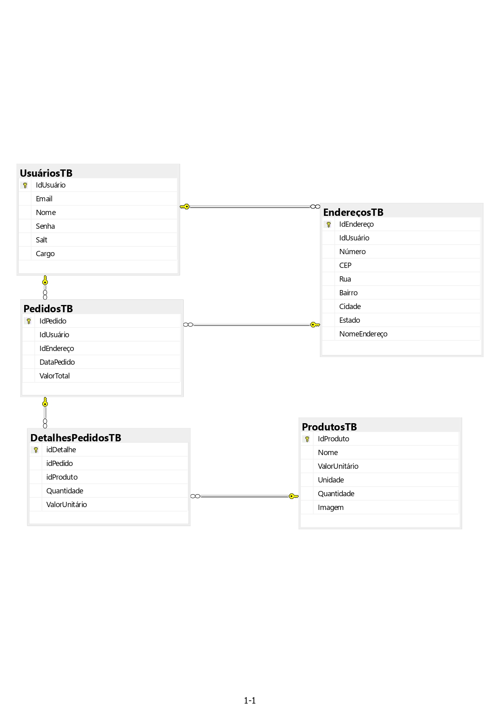
  
  Pelo diagrama, é possível ver que há 5 tabelas no banco de dados, que se conectam por seus id's.
  A criação do banco de dados e suas tabelas foram feitas com os comandos do arquivo "Datatables.sql". Foi utilizado no projeto **sql server** junto com **Microsoft Server Managment Studio**
  * A tabela usuários possui as colunas idUsuário (key primária), email, nome, senha (já com hash salt e pepper), salt (criado pelo backend) e cargo (cliente ou moderador)
  * A tabela endereços possui uma relação "1 to many" com a de usuários, ou seja, o mesmo usuário pode possuir vários endereços diferentes. Cada endereço é conectado com o usuário pelo idUsuário. Ela possui as colunas Número, Cep, Rua, Bairro, Cidade, Estado e NomeEndereço (por exemplo casa, trabalho, etc)
  * A tabela Pedidos é a tabela com todos os pedidos de compras feitos no site. Tem uma relação "1 to many" com as tabelas usuário e endereços (cada usuário e endereço podem possuir vários pedidos), e são conectados pelos seus respectivos id's. Além disso, ela possui a data do pedido, e o seu valor total
  * A tabela DetalhesPedidos é a tabela que mostra os produtos e suas quantidade compradas em cada pedido. Possui relação "1 to many" com pedidos (mesmo pedido pode possuir vários DetalhesPedidos, ou seja vários produtos diferentes comprados no mesmo pedido). 
  * A última tabela é a de produtos, que é a tabela feita com os dados da spoonacular api. Possui uma relação "1 to many" com a detalhesPedidos, o mesmo produto pode estar em vários pedidos diferentes.

  
Backend c#

  O BackEnd do projeto foi feito em c# no Microsoft Visual Studio 2022. 
  Nele, há 5 controllers, um para cada tabela do banco de dados. Para facilitar o uso deles, criei 3 camadas:
  
  * [MOD](https://github.com/LuccaRh/siteMercado/tree/main/Backend/MercadoApi/Mercado.MOD): Camada com os objetos que serão usados nas outras camadas e controllers. Ela possui variáveis proporcionais as colunas de sua respectiva tabela.
  * [BLL](https://github.com/LuccaRh/siteMercado/tree/main/Backend/MercadoApi/Mercado.BLL): Camada intermediária entre a DAL e controller. Faz as [verificações](https://github.com/LuccaRh/siteMercado/tree/main/Backend/MercadoApi/Mercado.BLL/Utilit%C3%A1rios) do que está sendo mandado do input para o banco de dados, como por exemplo a verificação da senha, e a leitura do cep do endereço
  * [DAL](https://github.com/LuccaRh/siteMercado/tree/main/Backend/MercadoApi/Mercado.DAL): Camada de comunicação com o banco de dados. Cria a query que será usada para as ações feitas no sql. Para essa comunicação, foi utilizada as bibliotecas dapper e Microsoft.Data.SqlClient

  
FrontEnd Javascript Html Css

  O FrontEnd foi criado com html, css e javascript utilizando o vscode. Como o intuito do projeto não estava em seu visual, a parte do css acabou sendo mais simples, assim focando mais em como seria a comunicação das Api's com o navegador, e como dispor e utilizar das informações do banco de dados nele por meio do javascript, requests, Json, funções assíncronas e html.

# Site Mercado

  
Cadastro

  
  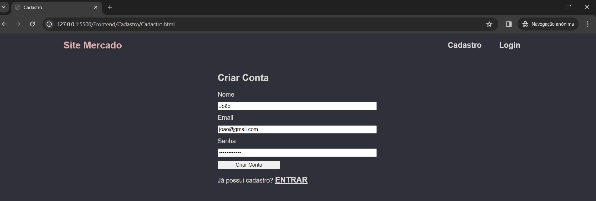
  Ná página de cadastro, irá pedir para colocar nome, email e senha para realizar o cadastro. 
  ## Cadastro Inválido:
  Caso o cadastro sejá inválido, irá mostrar na tela o erro que o ocorreu, entre eles incluí: 
  ### Senha inválida 
  Mínimo 8 caracteres e pelo menos um número e caracter especial, verificação realizada no [backend](https://github.com/LuccaRh/siteMercado/blob/main/Backend/MercadoApi/Mercado.BLL/Utilit%C3%A1rios/Verifica%C3%A7%C3%B5es.cs))
  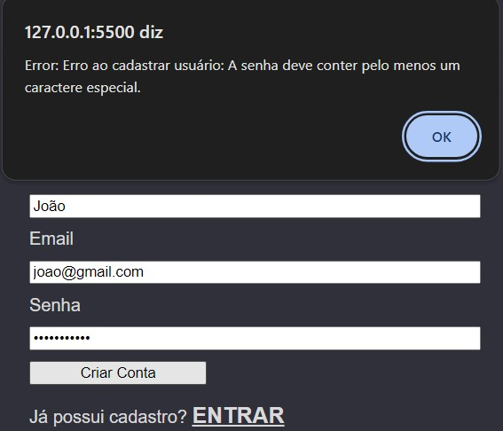\
(O erro é reconhecido pelo backEnd, que cria uma notificação de erro para o frontEnd, e é pego pelo seu block **try catch**)
  ### Nome, email ou senha não preenchidos
Verificação realizada no html, com input required  
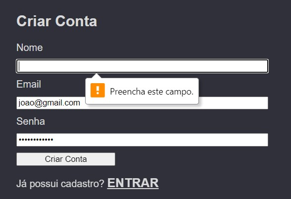
### Verificação de email 
Verificação realizada no html, com type = "email" 
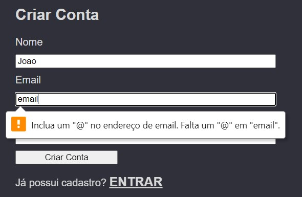
### Nome e Email já cadastrados 
Verificação realizada pelo sql server, colocando as colunas como UNIQUE  
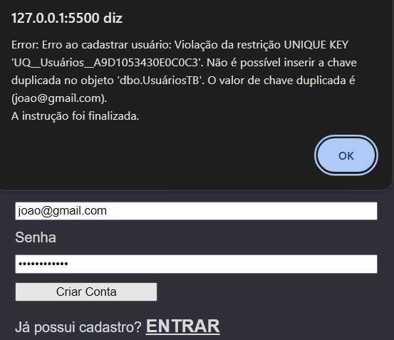

## Cadastro com sucesso:
Caso não haja erros no cadastro, irá ser realizado com sucesso, aparecendo uma mensagem de sucesso, e o usuário será redirecionado para a página de login.  

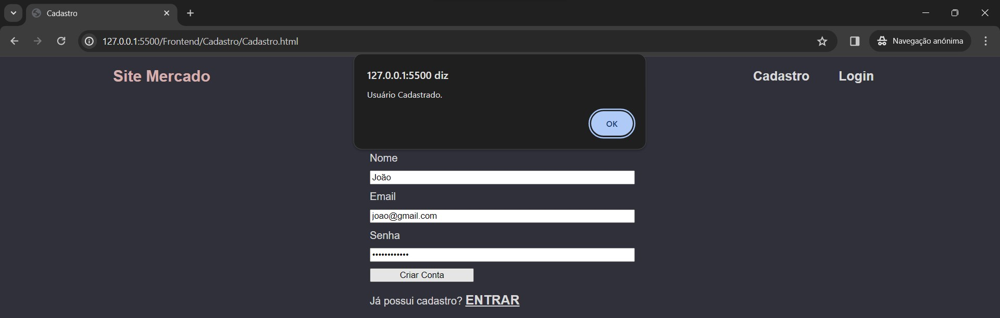 

No processo de criação do usuário, o backEnd irá pegar a senha feita pelo usuário, e [implementar hash, salt e pepper](https://github.com/LuccaRh/siteMercado/blob/main/Backend/MercadoApi/Mercado.BLL/Utilit%C3%A1rios/SenhaHashSaltPepper.cs) nela. Logo, ela não estará salva diretamente no banco de dados, mas sim, sua codificação junto com seu salt.
Os dados do usuário por fim serão salvos na tabela de usuários no banco de dados. 
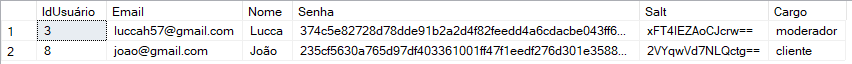 
(Note que o usuário já será cadastrado como cliente, pois só é possível ele ser moderador modificando diretamente pelo banco de dados, ou com outro moderador mudando seu cargo)

  
Login

  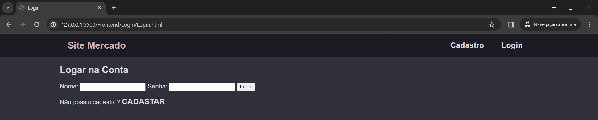 
  Na página de login, irá pedir para colocar nome e senha para realizar login. 
  Ela possui verificações de preenchimento do nome e senha igual ao do cadastro, e obviamente, a verificação se o usuário existe no banco de dados. 
  
  ---
  
  Primeiro é checado se o nome existe no banco de dados: 
  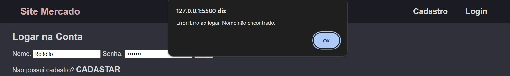 
  
  ---
  
  Caso o nome esteja no banco de dados, é checado a senha, codificando ela e a comparando com a salva no banco de dados, caso sejam iguais, o usuário é logado. 
  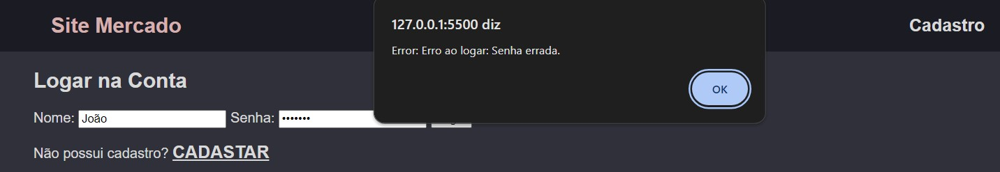 
  
  ## Token jwt
  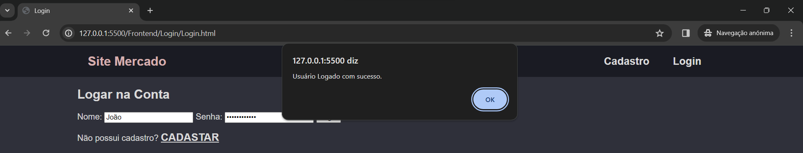 
  Caso as informações sejam certas, o login será realizado com sucesso, e o usuário irá ser redirecionado para o seu perfíl. 
  Ao logar no site, um token jwt é criado pelo [backend](https://github.com/LuccaRh/siteMercado/tree/main/Backend/MercadoApi/TokenJwtLogin) e armazenado no localStorage do navegador. Além disso, um token de validade é criado no [frontend](https://github.com/LuccaRh/siteMercado/blob/main/Frontend/Login/Login.js) para o tempo máximo de validade do outro token 
  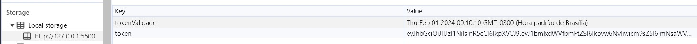 
  O token inclui o nome id e cargo do usuário, e é codificado, assim as informações dele só podem ser extraidas no backend. 
  Com o ele, o usuário é reconhecido no site, podendo acessar seu perfíl, criar e organizar seus endereços, comprar produtos, e caso seja moderador, administrar os usuários e produtos do site. 
  
  ---
  
  Caso o token passe do tempo de validade, irá aparecer uma mensagem avisando sobre, e o usuário irá ser automaticamente levado para a tela de login denovo 
  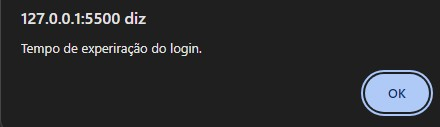 

  
Perfíl

    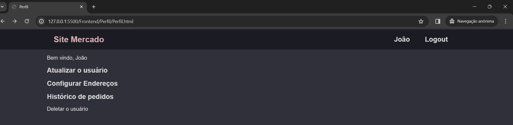 
  A página de perfil começa com o texto "bem vindo {nome}", o nome é pego utilizando o token criado e extraindo o nome de usuário dele. 
  
  ---
  
  O perfíl possui 3 links que levam o usuário para outra página (Atualizar, configuar Endereços e histórico de pedidos), e um botão para deletar o usuário, caso aperte o botão, irá abrir uma tela perguntando se tem certeza da ação, e caso confirme, o usuário então será deletado do banco de dados, e irá voltar para a página de cadastro. 
  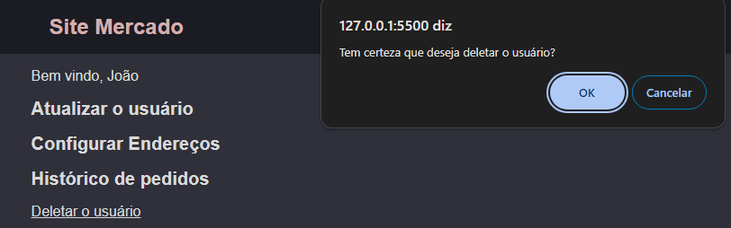 
  
  ---
  
  Além disso, caso o usuário seja moderador, irá aparecer os links de administração de usuários e produtos:
  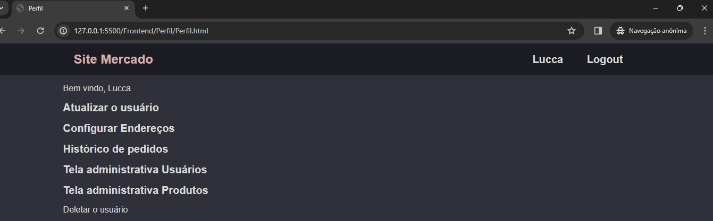 

  
Home

  
Atualizar Usuário

  
Configurar Endereços

  
Histórico de Pedidos

